# OSFileMetadataStrip — Architecture

Structural reference for the solution, the runtime component, and the test/XIF
projects. Keep this file in sync with the code — the `documentation-updater`
agent updates it as part of the change cycle whenever the solution layout,
Server Action surface, partial-class split, dependency set, or XIF structure
changes.

> **Runtime behaviour**, **supported formats**, and **Server Action signatures**
> live in [README.md](./README.md) and the [docs/platform/](./docs/platform)
> Forge copies. This document describes **structure only** — how the code is
> organised, why it is split the way it is, and where each concern lives.

---

## 1. Solution layout

Two implementations of the same Server Action surface, plus one test project
per implementation, plus a raw XIF source tree that Integration Studio owns.

```
OSFileMetadataStrip/                             ← repo root
├── FileMetadataStripping.sln                    ← solution (loads all five .csproj files)
├── FileMetadataStripping/                       ← ODC External Library (net10.0)
├── FileMetadataStripping.Tests/                 ← ODC xUnit suite (net10.0)
├── FileMetadataStripping.O11/                   ← O11 Integration Studio extension (net48)
├── FileMetadataStripping.O11.Tests/             ← O11 xUnit suite (net48) — primary (Magick.NET) engine
├── FileMetadataStripping.O11.GDI.Tests/         ← O11 xUnit suite (net48) — GDI+ fallback engine mirror
├── xif/                                         ← Integration Studio source tree
│   ├── FileMetadataStripping.xif                ← zlib-compressed XML metadata
│   └── FileMetadataStripping/Source/NET/...     ← IS-generated solution (build target)
├── tools/                                       ← ancillary utilities (sample generators, etc.)
├── docs/                                        ← README/Forge copies, versioned changelogs
└── OSFileMetadataStrip/xif/                     ← nested XIF artefacts (auxiliary, not the build target)
```

The `.sln` is the canonical solution for VS Code / Visual Studio. The XIF has
its **own** IS-generated `.sln` under `xif/.../Source/NET/` which is only ever
built by `dotnet msbuild` (with Integration Studio closed) — see §6.

---

## 2. ODC External Library — `FileMetadataStripping/`

Target framework: **`net10.0`**. Namespace: `FileMetadataStripping`.
Primary class: `FileMetadataStripping` (partial), implementing `IFileMetadataStripping`.

### Public surface

| File | Type | Purpose |
|------|------|---------|
| [IFileMetadataStripping.cs](FileMetadataStripping/IFileMetadataStripping.cs) | `[OSInterface]` | Declares `StripFileMetadata(byte[], bool) → FileMetadataResult` |
| [FileMetadataResult.cs](FileMetadataStripping/FileMetadataResult.cs) | `[OSStructure]` | Output struct: `CleanFile`, `ExtractedMetadata`, `RemovedEntryCount`, `IsPassthrough` |

### Partial-class split

The implementation is intentionally split across many partials so no single
file exceeds ~500 lines and each format family is discoverable by filename:

| File | Responsibility |
|------|---------------|
| [FileMetadataStripping.cs](FileMetadataStripping/FileMetadataStripping.cs) | Public entry point `StripFileMetadata`, `FileCategory` enum, `DetectCategory` binary-signature dispatcher, `DetectZipCategory` (routes ZIP-containers), `Passthrough` |
| [FileMetadataStripping.Images.cs](FileMetadataStripping/FileMetadataStripping.Images.cs) | Raster + SVG strip pipelines (Magick.NET + `System.Xml.Linq` for SVG). Also hosts the shared XML text-node cleaner. |
| [FileMetadataStripping.Documents.Pdf.cs](FileMetadataStripping/FileMetadataStripping.Documents.Pdf.cs) | PDF `/Info`, XMP catalog stream, annotation `/Author` (PDFsharp) |
| [FileMetadataStripping.Documents.OpenXml.cs](FileMetadataStripping/FileMetadataStripping.Documents.OpenXml.cs) | OOXML (DOCX/XLSX/PPTX + macro/template variants) core/app/custom properties, thumbnail, `StripBodyAuthors` blanking. Also hosts the Word 2003 WordML flat-XML strip path. |
| [FileMetadataStripping.Documents.LegacyOffice.cs](FileMetadataStripping/FileMetadataStripping.Documents.LegacyOffice.cs) | CFBF / OLE Compound Document (DOC/XLS/PPT 97–2003) via OpenMcdf + OpenMcdf.Ole |
| [FileMetadataStripping.Documents.Rtf.cs](FileMetadataStripping/FileMetadataStripping.Documents.Rtf.cs) | Regex-based `\info` group scrubber (no NuGet) |
| [FileMetadataStripping.Documents.Odf.cs](FileMetadataStripping/FileMetadataStripping.Documents.Odf.cs) | ODF ZIP-based strip + Flat ODF (`.fodt` / `.fods` / `.fodp`). Hosts the shared `ExtractAndClearOdfMetadata` helper and the `StartsWithXmlAngleBracket` byte-prefix helper reused across XML pipelines. |
| [FileMetadataStripping.Documents.Epub.cs](FileMetadataStripping/FileMetadataStripping.Documents.Epub.cs) | EPUB OPF Dublin Core + `<meta>` refinements (with Zip Slip guard on OPF path) |
| [FileMetadataStripping.Documents.Ora.cs](FileMetadataStripping/FileMetadataStripping.Documents.Ora.cs) | Open Raster `stack.xml` `name`/`description` attributes |
| [FileMetadataStripping.Media.cs](FileMetadataStripping/FileMetadataStripping.Media.cs) | Audio + video via TagLibSharp |

Add a new format inside an existing family by extending its partial; add a new
family by creating a new `FileMetadataStripping.<Family>.cs` partial and adding
a `FileCategory` value + `DetectCategory` branch in the shell.

### ODC processing flow

```mermaid
flowchart LR
    In[byte&#91;&#93; rawFile] --> Detect{DetectCategory}
    Detect -->|PDF magic| Pdf[StripPdfMetadata]
    Detect -->|RTF prefix| Rtf[StripRtfMetadata]
    Detect -->|CFBF magic| Legacy[StripCfbfMetadata]
    Detect -->|ZIP PK| Zip{DetectZipCategory}
    Detect -->|Image magics| Img[StripImageMetadata]
    Detect -->|SVG root| Svg[StripSvgMetadata]
    Detect -->|WordML root| Wml[StripWordMlMetadata]
    Detect -->|Flat ODF root| Fodf[StripFlatOdfMetadata]
    Detect -->|Audio/Video magic| Media[StripMediaMetadata]
    Detect -->|Otherwise| Pass[Passthrough]
    Zip -->|OOXML| Oox[StripOpenXmlMetadata]
    Zip -->|ODF| Odf[StripOdfMetadata]
    Zip -->|EPUB| Epub[StripEpubMetadata]
    Zip -->|ORA| Ora[StripOraMetadata]
    Pdf & Rtf & Legacy & Oox & Odf & Fodf & Epub & Ora & Img & Svg & Wml & Media & Pass --> Out[FileMetadataResult]
```



### Runtime dependencies

Declared in [FileMetadataStripping.csproj](FileMetadataStripping/FileMetadataStripping.csproj).

| Package | License | Used in partial |
|---------|---------|-----------------|
| `OutSystems.ExternalLibraries.SDK` | Apache 2.0 | shell (attributes) |
| `Magick.NET-Q8-AnyCPU` | Apache 2.0 | `.Images.cs` |
| `PDFsharp` | MIT | `.Documents.Pdf.cs` |
| `DocumentFormat.OpenXml` | MIT | `.Documents.OpenXml.cs` |
| `OpenMcdf` + `OpenMcdf.Ole` | MPL 2.0 | `.Documents.LegacyOffice.cs` |
| `TagLibSharp` | LGPL 2.1 | `.Media.cs` |
| `System.IO.Packaging`, `System.Text.Json`, `System.IO.Compression`, `System.Xml.Linq` | BCL | shell + several partials |

Authoritative version pins live in the `.csproj`. THIRD-PARTY-NOTICES.md holds
the license attribution copy.

### Build & package

`generate_upload_package.ps1` runs `dotnet publish -c Release -r linux-x64`
and zips the publish folder into `ExternalLibrary.zip`. The 90 MB ODC upload
ceiling is enforced by the script; see [.github/rules/architecture-rules.md](../.github/rules/architecture-rules.md).

---

## 3. O11 Integration Studio Extension — `FileMetadataStripping.O11/`

Target framework: **`net48`**, `LangVersion=12`. Namespace: `OutSystems.NssFileMetadataStripping`.

### Public surface (Integration Studio–generated names)

| File | Type | Purpose |
|------|------|---------|
| [IssFileMetadataStripping.cs](FileMetadataStripping.O11/IssFileMetadataStripping.cs) | Interface | O11 counterpart of `IFileMetadataStripping` — declares `MssStripFileMetadata` |
| [RecFileMetadataResult.cs](FileMetadataStripping.O11/RecFileMetadataResult.cs) | Struct | O11 counterpart of `FileMetadataResult` — `ss`-prefixed fields |

### Partial-class split

Mirrors the ODC split **file for file**. Every partial in
`FileMetadataStripping.O11/Actions/` corresponds to the ODC partial with the
same base name:

```
Actions/
├── FileMetadataStrippingActions.cs                       ← shell (dispatcher + native-DLL preload guard + _magickBroken latch)
├── FileMetadataStrippingActions.Images.cs                ← primary engine (Magick.NET) + magic-byte format detector shared with the fallback
├── FileMetadataStrippingActions.Images.Gdi.cs            ← fallback engine (System.Drawing / GDI+) — activated when Magick.NET native init fails
├── FileMetadataStrippingActions.Documents.Pdf.cs
├── FileMetadataStrippingActions.Documents.OpenXml.cs
├── FileMetadataStrippingActions.Documents.LegacyOffice.cs
├── FileMetadataStrippingActions.Documents.Rtf.cs
├── FileMetadataStrippingActions.Documents.Odf.cs
├── FileMetadataStrippingActions.Documents.Epub.cs
├── FileMetadataStrippingActions.Documents.Ora.cs
└── FileMetadataStrippingActions.Media.cs
```

The single wrapper class is `CssFileMetadataStripping : IssFileMetadataStripping`.
The document / SVG / media pipelines are pure-managed and logically identical
to the ODC partials — only the entry point signature and result-marshalling
change (populates a `RecFileMetadataResult` from an internal
`FileMetadataResult`). The **image** pipeline is the only surface that diverges
from ODC: it has a two-engine dispatcher (see next section) so the extension
still strips JPEG/PNG/GIF/BMP/TIFF on locked-down O11 hosts where Magick.NET's
native library cannot initialise.

### O11 processing flow — two-engine image dispatcher

The O11 build has **no runtime engine switch** for documents, SVG, or media —
`MssStripFileMetadata` is a thin marshalling shell around the same
`DetectCategory` dispatcher used by ODC. The only structural additions vs §2
are the OutSystems out-parameter signature, the field-prefix mapping into
`RecFileMetadataResult`, and a two-engine dispatcher on the **image** branch.

The image dispatcher lives in `FileMetadataStrippingActions.Images.cs` as
`StripImageMetadataWithFallback`. It:

1. Reads an AppDomain-scoped `_magickBroken` flag (declared in the shell) —
   if already latched, delegates directly to the GDI+ engine.
2. Otherwise attempts `StripImageMetadataWithMagick` (unchanged Magick.NET
   pipeline).
3. If Magick.NET throws `TypeInitializationException` (native DllMain refused —
   HRESULT `0x8007045A` / `ERROR_DLL_INIT_FAILED`, typical on the OutSystems
   Personal Environment sandbox), latches the flag with `Interlocked.Exchange`
   and retries the same input through `StripImageMetadataWithGdi`.

A best-effort **native-DLL preload guard** on `MssStripFileMetadata` entry
(`EnsureMagickNativePreloaded` in the shell) resolves
`Magick.Native-Q8-x64.dll` from an absolute path next to the extension
assembly and calls `LoadLibraryExW` with `LOAD_WITH_ALTERED_SEARCH_PATH`. On
healthy hosts the OS returns the already-loaded module handle and it is a
no-op; on hosts where the preload itself is refused it is also a silent
no-op and the fallback path takes over on the first image call. The preload
state is latched in a separate `_preloadState` flag so the P/Invoke is
attempted at most once per AppDomain.

`DetectCategory` is also aware of the fallback: on the image detection branch
it still calls `MagickImageInfo` on healthy hosts, but when `_magickBroken`
is set it short-circuits to a pure-managed magic-byte detector
(`DetectImageFormatByMagicBytes`, shared with the GDI+ engine) so image
category routing still works after native init has failed.

```mermaid
flowchart LR
    In[byte&#91;&#93; ssRawFile<br/>bool ssStripBodyAuthors] --> Preload[EnsureMagickNativePreloaded<br/>&#40;once per AppDomain&#41;]
    Preload --> Detect{DetectCategory<br/>&#40;magic-byte fallback if<br/>_magickBroken == 1&#41;}
    Detect -->|Image| ImgDisp{StripImageMetadataWithFallback}
    Detect -->|Svg / Pdf / Rtf / OpenXml / WordMl /<br/>LegacyOffice / Odf / FlatOdf / Epub / Ora / Media| Managed[Pure-managed pipelines<br/>&#40;identical to §2&#41;]
    Detect -->|Passthrough| Pass[Passthrough]
    ImgDisp -->|_magickBroken == 0| Magick[StripImageMetadataWithMagick]
    ImgDisp -->|_magickBroken == 1| Gdi[StripImageMetadataWithGdi]
    Magick -->|TypeInitializationException| LatchAndRetry[Latch _magickBroken := 1]
    LatchAndRetry --> Gdi
    Magick & Gdi & Managed & Pass --> Internal[Internal FileMetadataResult]
    Internal --> Map[Marshal fields:<br/>CleanFile         → ssCleanFile<br/>ExtractedMetadata → ssExtractedMetadata<br/>RemovedEntryCount → ssRemovedEntryCount<br/>IsPassthrough     → ssIsPassthrough]
    Map --> Out[out RecFileMetadataResult ssStripFileMetadata]
```



**GDI+ fallback contract** (see `FileMetadataStrippingActions.Images.Gdi.cs`):

| Input class | `IsPassthrough` | `RemovedEntryCount` | `CleanFile` | `ExtractedMetadata` |
|-------------|-----------------|---------------------|-------------|---------------------|
| Actively stripped: JPEG, PNG, GIF, BMP, TIFF | `false` | `> 0` when metadata present | Re-encoded clean image | JSON list of `PropertyItem` names removed |
| Recognised but GDI+ cannot decode: WebP, HEIC, HEIF, AVIF, JXL, JP2, J2c, JXR, PSD/PSB, DDS, EXR, HDR, DPX/CIN, FITS, QOI, SGI, SUN, PCX/DCX, PNM, JBIG, XCF, WMF, ICO, DCM, TGA, MNG, camera RAW variants | `false` | `0` | `originalBytes` verbatim | JSON with `processingError` prefixed `"GDI+ fallback:"` and the format name |
| Unrecognised bytes | `true` | `0` | `originalBytes` verbatim | `[]` |

The fixed `"GDI+ fallback:"` marker lets consumers distinguish a fallback
engine refusal from a normal processing error with a simple substring match.
The primary-engine interface is preserved — no new fields on
`RecFileMetadataResult`, no breaking change to `MssStripFileMetadata`.

### Runtime dependencies

Same NuGet packages as ODC, but pinned to the last net48-compatible major where
required (e.g. PDFsharp 1.50). Version pins live in
[FileMetadataStripping.O11.csproj](FileMetadataStripping.O11/FileMetadataStripping.O11.csproj).

The O11 csproj additionally has:

- A `<Reference Include="System.Drawing" />` for the GDI+ fallback engine —
  System.Drawing ships with .NET Framework 4.8, so no NuGet dependency is
  added and `THIRD-PARTY-NOTICES.md` is unchanged.
- An `<InternalsVisibleTo Include="FileMetadataStripping.O11.GDI.Tests" />`
  entry so the mirror test project can invoke
  `ForceGdiFallbackForTesting()` from its adapter static constructor (see §4).

---

## 4. Test projects

Three test projects. Both ODC and both O11 projects have **identical folder
layouts** and byte-for-byte identical test files. The O11 projects use local
adapter types in `TestHelpers.cs` so `_sut.StripFileMetadata(bytes)` and
`result.CleanFile` compile against the `ss`-prefixed O11 API.

### ODC tests — `FileMetadataStripping.Tests/`  (net10.0)

```
Images/            ← one per-format class per raster/vector format tested
Documents/         ← one class per document pipeline (PDF, OpenXml, WordML, LegacyOffice, RTF, ODF, FlatODF, EPUB, ORA)
Media/             ← audio + video classes
Passthrough/       ← cross-cutting passthrough contract (PassthroughTests.cs, HtmlPassthroughTests.cs)
TestHelpers.cs             ← partial shell (shared infrastructure)
TestHelpers.Images.cs
TestHelpers.Documents.<Pipeline>.cs   ← one per production partial
TestHelpers.Media.cs
```

Test data is **generated programmatically** with Magick.NET, DocumentFormat.OpenXml,
PDFsharp, TagLibSharp, `System.IO.Compression`, etc. **No binary test files are
committed.** Every generator lives in a `TestHelpers.*.cs` partial that mirrors
the production split.

### O11 primary-engine tests — `FileMetadataStripping.O11.Tests/`  (net48)

Same folder layout. The only extra file is the adapter block at the top of
[TestHelpers.cs](FileMetadataStripping.O11.Tests/TestHelpers.cs) which defines
a `FileMetadataResult` DTO, an `IFileMetadataStripping` interface, and a wrapper
class whose `StripFileMetadata` calls `MssStripFileMetadata` and maps the
`ss`-prefixed fields back to the ODC property names. Every other test file is
copied byte-for-byte from the ODC project — see [AGENTS.md](../AGENTS.md#-o11-test-adapter-pattern).
Exercises the Magick.NET engine.

### O11 GDI+ fallback mirror tests — `FileMetadataStripping.O11.GDI.Tests/`  (net48)

Parallel test project that pins the GDI+ fallback contract described in §3.
Same folder layout as the primary suite but only carries the tests whose
expected shape survives the switch to GDI+ (JPEG / PNG / GIF / BMP / TIFF
active-strip cases, recognised-but-unsupported error contract, unrecognised
passthrough).

The adapter's static constructor calls the shell's
`internal static void ForceGdiFallbackForTesting()` seam (exposed to this
assembly only, via `[InternalsVisibleTo]`) which sets `_magickBroken := 1`
once per AppDomain. Every subsequent test call under this assembly therefore
takes the GDI+ code path even on a healthy build agent. This is a
test-only seam — never called from production code.

### Test-coverage contract

For each supported format the [filemetadatastrip-test-coverage](../.github/skills/filemetadatastrip-test-coverage/SKILL.md)
skill defines the mandatory categories (strip, extract, count, format validity,
clean baseline, security invariant, IsPassthrough, format maintenance, special
conversions, edge cases). The [architecture-validator](../.github/agents/architecture-validator.agent.md)
enforces the checklist per format group after every change.

---

## 5. Docs & versioning artefacts

```
docs/
├── format-coverage.md               ← format × test-category matrix
├── platform/
│   ├── odc/
│   │   ├── forge-description.md     ← Forge page copy (ODC)
│   │   ├── limitations.md           ← Forge Limitations field  (≤ 1000 chars body)
│   │   └── documentation.md         ← Forge Documentation tab   (plain text)
│   └── o11/
│       ├── forge-description.md     ← Forge page copy (O11)
│       ├── limitations.md           ← Forge Limitations field  (≤ 1000 chars body)
│       └── documentation.md         ← Forge Documentation tab   (plain text)
└── versions/
    ├── UNRELEASED.md                ← in-progress change log
    ├── v{x.y.z}.md                  ← one Markdown file per Forge release
    └── v{x.y.z}.release-notes.txt   ← plain-text release-notes for Forge (≤ 10k chars)
```

`CHANGELOG.md` at the repo root is the version index. `THIRD-PARTY-NOTICES.md`
carries the attribution copy for every runtime NuGet package.

---

## 6. XIF source tree — `xif/`

Only relevant to the O11 workflow. Integration Studio owns the XIF; the agent
edits the extracted source between IS saves and re-builds via `dotnet msbuild`
with IS closed.

```
xif/
├── FileMetadataStripping.oap              ← O11 tester eSpace (produced from IS)
├── FileMetadataStripTester.oap            ← standalone tester eSpace
├── FileMetadataStripping.xif              ← zlib-compressed XML (extension metadata)
└── FileMetadataStripping/
    ├── Backups/                           ← timestamped safety copies
    ├── Icons/                             ← extension + action icons
    ├── Templates/                         ← IS project templates
    └── Source/NET/
        ├── FileMetadataStripping.sln      ← IS-generated solution — DO NOT edit its schema
        ├── FileMetadataStripping.csproj   ← classic-style csproj (no PackageReference — see below)
        ├── FileMetadataStripping.cs       ← agent-maintained (mirrors ODC + O11 implementation)
        ├── Records.cs / Structures.cs / Interface.cs
        │                                  ← IS-generated on every Update Source Code — DO NOT edit by hand
        └── bin/                           ← every managed + native DLL staged physically
```

Key XIF invariants (enforced by the [xif-updater](../.github/agents/xif-updater.agent.md)
agent):

- The `.csproj` uses the classic MSBuild schema — `PackageReference` is silently
  ignored. Every package's managed DLLs must be added as `<Reference>` with
  `<HintPath>bin\...dll</HintPath>` and `<Private>False</Private>`, and every
  native DLL must be physically staged in `bin\`.
- Integration Studio must be **closed** while editing source files or the csproj
  will be overwritten on the next save.
- Output-parameter Record types (`RCFileMetadataResultRecord`) are generated by
  IS in `Records.cs` — the agent must not hand-author them.

Full package → DLL mapping and the exact reference set are maintained in
[xif-updater.agent.md](../.github/agents/xif-updater.agent.md) §3.

---

## 7. Change-cycle integration

Every code change flows through the pipeline defined in
[AGENTS.md](../AGENTS.md#change-cycle-enforced-by-extension-builder).
This document is a **Stage 4** deliverable: the `documentation-updater` agent
compares the changed files against the sections above and updates whichever
part of this file no longer reflects the code (added partial, new dependency,
new Server Action, changed test-project layout, changed XIF structure).

If any of these truly change and this document is not updated in the same
change cycle, the pipeline summary must be marked `PARTIAL ⚠`.
